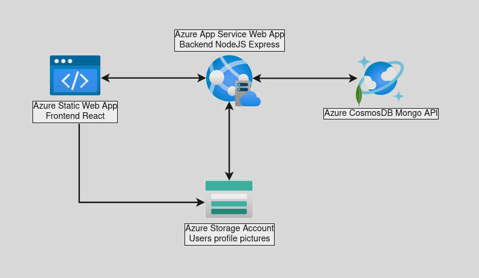

# MySweetDreams Deployment 
This repository contains an **Azure Resource Manager (ARM) template** that defines the infrastructure and resources necesary to deploy a full stack website.
It also contains a **bash script** to initiate the deployment and setup some necesary configuration.

## What is this

**MySweetDreams** is a platform that aims to help people take better care of their sleep hours, and thus improve their health and vitality.

**MERN Stack** fullstack web application, **collaborative project** for a webdev formation.

### Original repositories
- [Landing](https://github.com/angelrcd/mysweetdreams-landing)
- [Frontend](https://github.com/angelrcd/mysweetdreams)
- [Backend](https://github.com/NuberuSH/mysweetdreams-back)

## Architecture

### 1. Frontend
- Hosted in **Azure Static Web App**
- Web frontend built with **React**
- Styled with **Tailwind**
- CI/CD integration with a Github repository

### 2. Backend
- Hosted in **Azure App Service Web App**
- Application containerized using **Docker**
- Express API
- Self implemented **user authentication**
- CI/CD integration with a DockerHub repository

### 3. Storage
- Storage solution using **Azure Storage Account**
- Used to host user's uploaded profile pictures

### 4. Database
- **CosmosDB** distributed database using the **Mongo API**